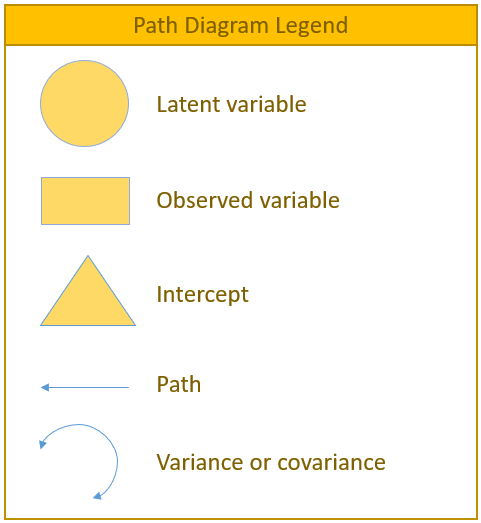
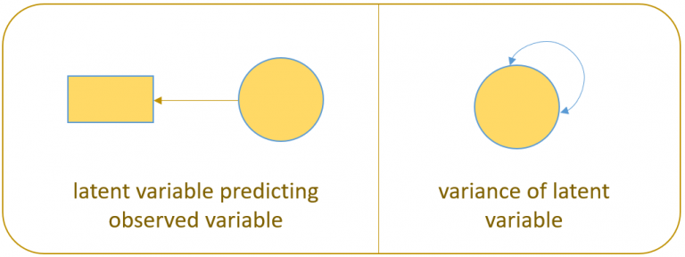
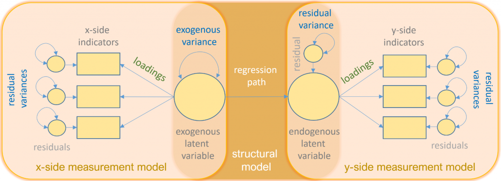
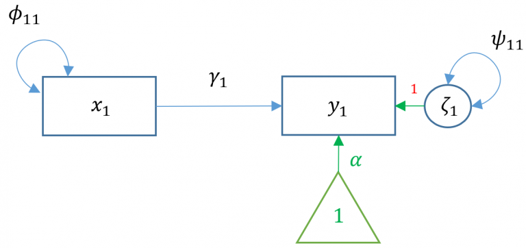

```{r setup, include=FALSE}
knitr::opts_chunk$set(echo = TRUE, size = "tiny")
def.chunk.hook  <- knitr::knit_hooks$get("chunk")
knitr::knit_hooks$set(chunk = function(x, options) {
  x <- def.chunk.hook(x, options)
  ifelse(options$size != "normalsize", paste0("\n \\", options$size,"\n\n", x, "\n\n \\normalsize"), x)
})

```


# Introduction to SEM


### Purpose

This seminar introduces basic concepts of structural equation modeling (SEM) using lavaan in the R programming language.
The emphasis is on **identifying various manifestations of SEM models** and **interpreting the output.**.


**Fundamental topics covered include:**

* Matrix notation
- Identification
- Model fit
- Various kind of models...


Assumption: All variables are continuous and normally distributed.


# Introduction

### What's SEM?


Structural equation modeling (SEM) is a linear model framework that models both **simultaneous regression equations** with **latent variables**. 

Special cases of SEM:

* linear regression
* multivariate regression
* path analysis
* confirmatory factor analysis
* structural regression

### What can we do in SEM?

Using SEM, one can model the following relationships

* observed to observed variables (e.g., regression)
* latent to observed variables (e.g., confirmatory factor analysis)
* latent to latent variables (e.g., structural regressoins)

We can fit **measurement** (relating observed to latent variables) models and **structural** (relating latent to latent variables) models

### Let's get started

Now let's install lavaan

```{r}
# "install" commands are commented out since I have 
# already installed it. I recommend running it 
# in the console, not in markdown
# install.packages("lavaan", dependencies = TRUE)
library(lavaan)
```

### Let's import data


```{r Data import}

df <- read.csv("./data/test.csv")
head(df)
```

### The Variance-Covariance Matrix

The most essential component of a structural equation model is **covariance** between items. We can view the true population covariance within observed variables in the variance-covariance matrix which we shall call $\Sigma$.
As we cannot observe the **true** variance-covariance matrix, we have to estimate it with our sample and call it $\hat{\Sigma} = S$, the sample variance-covariance matrix. In R, we can use the function cov() for it.

### The Variance-Covariance Matrix

Let's observe the variance-covariance matrix for four burnout and psychological safety items.

```{r}
cov(df[,2:6])
```

### The Variance-Covariance Matrix

Using the sample variance-covariance, we can see how observed variables are connected to one another. The matrix is symmetric and should not be confused with the model-implied covariance matrix $\Sigma(\Theta)$. 

The sole purpose of any kind of SEM is to reproduce $\Sigma$ as accurately as possible using a set of parameters **$\Theta$**, so that $\Sigma = \Sigma(\Theta)$.

### Definitions

Let's clear up some key words

\footnotesize

- **observed variable**: a variable that exists in the data
- **latent variable**: a variable that is constructed and does not exist in the data
* **exogenous variable**: an independent variable either observed (x) or latent ($\xi$) that explains an endogenous variable
* **endogenous variable**: a dependent variable, either observed (y) or latent ($\eta$) that has a explanatory path leading to it
* **measurement model**: a model that links observed variables with latent variables
* **indicator**: an observed variable in a measurement model (can be exogenous or endogenous)
* **factor**: a latent variable defined by its indicators (can be exogenous or endogenous)
* **loading**: a path between an indicator and a factor
* **structural model**: a model that specifies causal relationships among exogenous variables to endogenous variables (can be observed or latent)
* **regression path**: a path between exogenous and endogenous variables (can be observed or latent)

### Path diagrams

Strange Greek math symbols and matrix equations are scary. Also, only nerds can pronounce, let alone understand this kind of notation. That's why we additionally provide **path diagrams**.

{width=40%}


### Path diagrams

Here, we see a regression of a factor (latent) on an item (observed). The right image depicts the variance of the factor.

{width=70%}


### Path diagrams

Now let's have a look at all the possible symbols that we can encounter in path diagrams.

{width=90%}

### Basic lavaan syntax

Let's have a look at lavaan's basic syntax:
\small

* **~** predict, used for regression of observed outcome to observed predictors (e.g., y ~ x)
* **=~** indicator, used for latent variable to observed indicator in factor analysis measurement models (e.g., f =~ q + r + s)
* **~~** covariance (e.g., x ~~ x)
* **~1** intercept or mean (e.g., x ~ 1 estimates the mean of variable x)
* **1* **fixes parameter or loading to one (e.g., f =~ 1*q)
* **NA* **frees parameter or loading (useful to override default marker method, (e.g., f =~ NA*q)
* **a* **labels the parameter ‘a’, used for model constraints (e.g., f =~ a*q)


# Regression and Path Analysis

## Simple Regression

You will most likely know this equation:

$y_1 = b_0 + b_1 x_1 + \epsilon_1$

Here, $b_0$ is the intercept, $b_1$ is the coefficient and $x_1$ is the observed predictor while $\epsilon_1$ is the residual. 
However, in SEM one often finds the LISREL notation, which reads as follows:

$y_1 = \alpha + \gamma x_1 + \zeta_1$

## Simple regression

$y_1 = \alpha + \gamma x_1 + \zeta_1$

{width=90%}

## Simple regression

The standard way to run a linear regression in R is the lm() function from base R.


```{r simple regression}

m1a <- lm(Bout_t1 ~ Psysa_t1,data=df)
fit1a <- summary(m1a)
fit1a

```

## Simple regression in lavaan

Now we estimate the same regression in lavaan(). Here, the intercept is not included by default so we have to add it.
```{r, out.extra='\\scriptsize'}

m1b <- '
  # regression
  Bout_t1 ~ 1 + Psysa_t1
  # Variance
  Psysa_t1 ~~ Psysa_t1 # this is estimated by default in lavaan
'
fit1b <- sem(m1b, data=df)
summary(fit1b)
```


## Maximum Likelihood vs. least squares

## Multiple regression

# Model Fit Statistics

# Measurement Model

# Structural Model